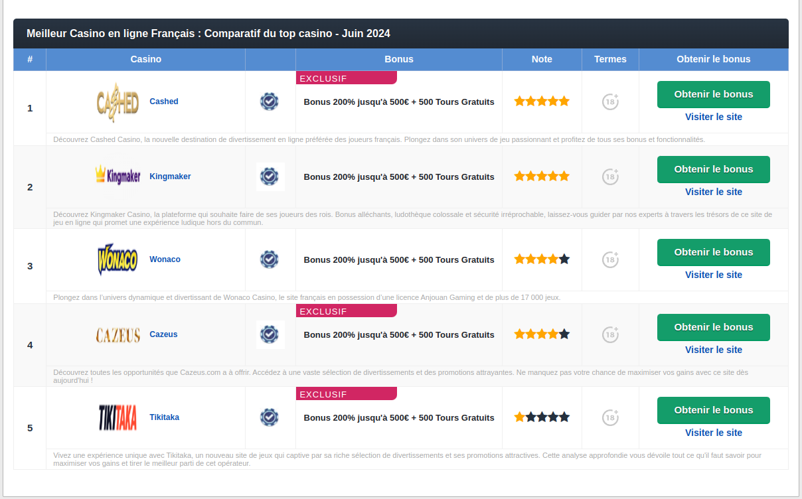

# Brand Frontend

## Screenshots


## clone the application

```bash
git clone https://github.com/cybersoldattech/brands-front-end.git
cd brands-front-end
```

Before starting the project, please start the brand back-end project: https://github.com/cybersoldattech/brands-back-end.git

## Run application

```bash
docker-compose up --build
```

```bash
http://localhost:8080
```

http://localhost:8080

## Stop application

```bash
docker-compose down
```
